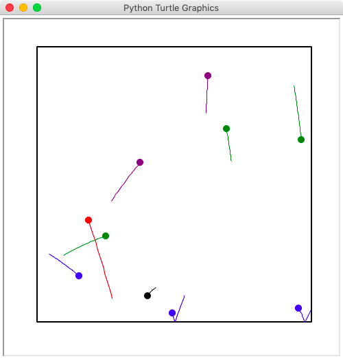

# Graphical Ball Motion Simulation

In this assignment, you are to implement a graphical motion simulation of
multiple ball objects, as shown.

## Modules

Your application consists of five modules, three of which must be completed by
you.

### 1. Module `vector.py`

This module contains the `Vector` class for creating various vector
quantities used by the simulation.

The provided `vector.py` contains only some template code that you must
complete yourself.  Please look at `vector.py`'s
[documentation](docs/vector.md) for more details, including test cases that
will be used to grade this module.

### 2. Module `border.py`

This module contains the `Border` class for create a border surrounding
balls on the stage.

The provided `border.py` contains only some template code that you must
complete yourself.  Please look at `border.py`'s
[documentation](docs/border.md) for more details, including test cases that
will be used to grade this module.

### 3. Module `ball.py`
This module contains the `Ball` class for creating ball objects with
various physical properties such as position, velocity, and acceleration.
Each ball object knows how to update its own velocity and position.  When
surrounded by a border, the ball also knows when it hits a border's side and
updates its position and velocity accordingly.

The provided `ball.py` contains only some template code that you must
complete yourself.  Please look at `ball.py`'s
[documentation](docs/ball.md) for more details, including test cases that
will be used to grade this module.

### 4. Module `stage.py`
This module provides the `Stage` class for creating a `Stage` object that
incorporates a `Border` object and a list of `Ball` objects.  It is also
responsible for creating a graphical screen and a turtle-based painter object
to be used by the `Border` and `Ball` objects to draw themselves on the
screen.

This module is already completely implemented.  You don't have to add
anything.

### 5. Module `app.py`
This module implements an application that demonstrates the use of all the modules above
in a graphical window.

This module is already completely implemented.  You don't have to add
anything.

## Running Tests

Non-graphical tests can be performed by running each of the `vector.py`,
`border.py`, and `ball.py` directly.  They use the `doctest` to run all
examples found inside all the documentation files in the `docs` directory.

    python vector.py
    python border.py
    python ball.py

## Graphical Output

The graphical output elements is taken care of by the `stage.py` module.
However, you are required to implement the `draw` method in your `ball.py` and
`border.py`.  The `draw` method takes one `painter` argument which is a
`Turtle` object.  Consult [this
document](https://docs.python.org/3/library/turtle.html#turtle-methods) for
the list of turtle's drawing commands.

There is no definite rule on how you should draw your objects.  However, at
least the following is required:

* A `Ball` object must show with its current `color` property.
* A `Ball` object must show its movement trail, which keep track of the past
  10 positions of the ball.
* A `Border` object must clearly display its boundary.

## Your Task

1. Complete the implementations of the `vector.py`, `border.py`, and `ball.py`
   modules.  Make sure they all pass the tests.
2. Implement the `draw` methods in `ball.py` and `border.py`, then run
   `app.py` to see the graphical result and visually inspect the
   correctness.
3. Modify the `summary.txt` file.  In this summary, tell us what you have
   completed and what you have not.

**Notes:** Please do not change any file inside the `docs` directory.  These
files will be used to run tests against your submitted code.

## Submission

1. Check that everything is working as expected, i.e., all the tests are
   passed and the graphical application is running correctly.
2. Commit your code with all related files
    * `vector.py`
    * `border.py`
    * `ball.py`
    * `summary.txt`
3. Push the commit to GitHub
4. Wait for GitHub Classroom to mail back your grading result.  Please note
   that the automatic grading is applied to the non-graphical parts of the
   assignment only.  The visual part will be graded manually by the TAs.

## Grading Criteria

1. **Non-graphical correctness (40%):** Your program must pass all the doctests.
2. **Graphical correctness (40%):** Your program gives expected behavior on the
   graphical window.
3. **Cleanliness (20%):** Your program must follow the PEP8 convention.  Variable
   names are meaningful.  Docstrings are written for all methods and
   functions.  Comments are added at certain points for others to understand
   your code easily.
   
