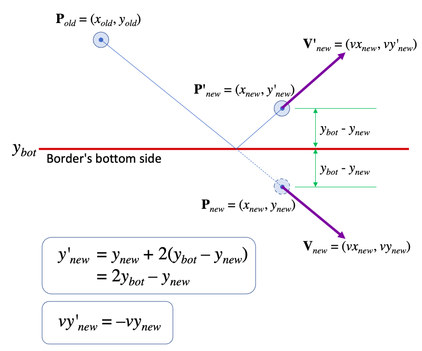

# Module `ball.py`

The `ball.py` module defines the `Ball` class.  It is used in conjunction
with the `Vector` and `Border` classes.

    >>> from ball import Ball
    >>> from vector import Vector
    >>> from border import Border

Ball properties
===============

Each Ball object maintains five properties, `pos`, `vel`, `acc`, `border`, and `color`.

    >>> type(Ball.pos)
    <class 'property'>
    >>> type(Ball.vel)
    <class 'property'>
    >>> type(Ball.acc)
    <class 'property'>
    >>> type(Ball.border)
    <class 'property'>
    >>> type(Ball.color)
    <class 'property'>

Initialization
==============

A `Ball` object must be initialized with three vectors for the `pos`, `vel`, and
`acc` properties, to represent its position, velocity, and acceleration,
respectively.

    >>> b = Ball(pos=Vector(0, 2), vel=Vector(5, 1), acc=Vector(1, -2))
    >>> b.pos
    Vector(x=0, y=2)
    >>> b.vel
    Vector(x=5, y=1)
    >>> b.acc
    Vector(x=1, y=-2)

The `border` property is initialized to `None`.

    >>> b.border
    >>>

The `color` property is initialized to `'black'`.

    >>> b.color
    'black'

Representation
==============

The string representation of a `Ball` object provides the current values of
the `pos`, `vel`, and `acc` properties.

    >>> b
    Ball(pos=Vector(x=0, y=2), vel=Vector(x=5, y=1), acc=Vector(x=1, y=-2))

Updating Properties
===================

The `pos`, `vel`, and `acc` properties can be updated with new `Vector` objects.

    >>> b.pos = Vector(5, 3)
    >>> b.vel = Vector(3, 0)
    >>> b.acc = Vector(0, -9.8)
    >>> b
    Ball(pos=Vector(x=5, y=3), vel=Vector(x=3, y=0), acc=Vector(x=0, y=-9.8))

A `TypeError` exception must be raised if any of these properties is assigned
with a non-`Vector` object.

    >>> b.pos = "hello"
    Traceback (most recent call last):
    ...
    TypeError: pos must be a Vector object

    >>> b.vel = "goodbye"
    Traceback (most recent call last):
    ...
    TypeError: vel must be a Vector object

    >>> b.acc = [1, 2, 3]
    Traceback (most recent call last):
    ...
    TypeError: acc must be a Vector object

The `border` property can be updated with a `Border` object, or set to `None`.
Other types will cause a `TypeError` exception to be raised.

    >>> b.border = Border(Vector(0, 0), 10, 20)
    >>> b.border
    Border(corner=Vector(x=0, y=0), width=10, height=20)

    >>> b.border = None
    >>> b.border

    >>> b.border = "abc"
    Traceback (most recent call last):
    ...
    TypeError: border must be a Border object

A new border, if not `None`, must cover the current position of the ball.  If
not, a `ValueError` must be raised.

    >>> b = Ball(pos=Vector(3, 4), vel=Vector(5, 1), acc=Vector(1, -2))
    >>> b.border = Border(Vector(0, 0), 10, 10)
    >>> b.border = Border(Vector(5, 5), 10, 10)
    Traceback (most recent call last):
    ...
    ValueError: border must cover the current ball's position

The `color` property takes a string value.  Other types will cause a
`TypeError` exception to be raised.

    >>> b.color = "red"
    >>> b.color
    'red'
    >>> b.color = 38
    Traceback (most recent call last):
    ...
    TypeError: color must be a string

Each object assigned to any property must be deep-copied so that changing a
property's internal state does not affect the original object.

    >>> v = Vector(3, 4)
    >>> b = Ball(pos=v, vel=v, acc=v)
    >>> b.pos.x = 8
    >>> b.vel.y = 12
    >>> b.acc.x = 5
    >>> v, b.pos, b.vel, b.acc
    (Vector(x=3, y=4), Vector(x=8, y=4), Vector(x=3, y=12), Vector(x=5, y=4))

    >>> b = Ball(pos=Vector(3, 2), vel=Vector(1, 5), acc=Vector(0, 0))
    >>> border = Border(Vector(0, 0), 5, 6)
    >>> b.border = border
    >>> b.border.corner.x = 1
    >>> b.border
    Border(corner=Vector(x=1, y=0), width=5, height=6)
    >>> border
    Border(corner=Vector(x=0, y=0), width=5, height=6)

Motion Updates
==============

The `update` method updates the `pos` and `vel` properties to the values after
the specified duration has passed.  The `acc` vector must not be affected by
each update.  Here, the `x` and `y` properties in the `pos` and `vel` vectors
are printed out directly with two decimal places to get around floating-point
errors.

Updates without a border
------------------------

    >>> b = Ball(pos=Vector(0, 2), vel=Vector(5, 1), acc=Vector(1, -2))
    >>> b.update(0.5) # update b to the next 0.5 second
    >>> f"pos=({b.pos.x:.2f},{b.pos.y:.2f}), vel=({b.vel.x:.2f},{b.vel.y:.2f})"
    'pos=(2.75,2.00), vel=(5.50,0.00)'
    >>> f"acc=({b.acc.x:.2f},{b.acc.y:.2f})"
    'acc=(1.00,-2.00)'
    >>> b.update(0.5) # update b to the next 0.5 second
    >>> f"pos=({b.pos.x:.2f},{b.pos.y:.2f}), vel=({b.vel.x:.2f},{b.vel.y:.2f})"
    'pos=(5.75,1.50), vel=(6.00,-1.00)'
    >>> f"acc=({b.acc.x:.2f},{b.acc.y:.2f})"
    'acc=(1.00,-2.00)'
    >>> b.update(0.1) # update b to the next 0.1 second
    >>> f"pos=({b.pos.x:.2f},{b.pos.y:.2f}), vel=({b.vel.x:.2f},{b.vel.y:.2f})"
    'pos=(6.36,1.38), vel=(6.10,-1.20)'
    >>> f"acc=({b.acc.x:.2f},{b.acc.y:.2f})"
    'acc=(1.00,-2.00)'

Updates with a border
---------------------

Each update must perform a border check.  If the ball's new position is
outside of the border, the `update` method must recompute the new position of
the ball, and also change its velocity accordingly.

For simplicity, we will assume that a ball is just a point with no size.  The
diagram below illustrates a scenario where a ball is hitting the bottom side
of the border.  In this case only `pos.y` and `vel.y` properties are affected
and need to be adjusted using the formulas in the boxes.

Here is an example of the ball's properties after hitting the border's bottom
side.

    >>> b = Ball(pos=Vector(3, 4), vel=Vector(1, -5), acc=Vector(0, 0))
    >>> b.border = Border(Vector(1, 2), 10, 9)
    >>> b
    Ball(pos=Vector(x=3, y=4), vel=Vector(x=1, y=-5), acc=Vector(x=0, y=0))
    >>> b.update(1)
    >>> b
    Ball(pos=Vector(x=4, y=5), vel=Vector(x=1, y=5), acc=Vector(x=0, y=0))

Calculating the ball's properties after hitting the other three sides can be
done in similar manners, which is left as an exercise for the students.  Here
is an example of the ball hitting the border's left side.

    >>> b = Ball(pos=Vector(3, 4), vel=Vector(-5, 1), acc=Vector(0, 0))
    >>> b.border = Border(Vector(1, 2), 10, 9)
    >>> b
    Ball(pos=Vector(x=3, y=4), vel=Vector(x=-5, y=1), acc=Vector(x=0, y=0))
    >>> b.update(1)
    >>> b
    Ball(pos=Vector(x=4, y=5), vel=Vector(x=5, y=1), acc=Vector(x=0, y=0))

Here is an example of the ball hitting the border's right side.

    >>> b = Ball(pos=Vector(8, 3), vel=Vector(5, 1), acc=Vector(0, 0))
    >>> b.border = Border(Vector(1, 2), 10, 9)
    >>> b
    Ball(pos=Vector(x=8, y=3), vel=Vector(x=5, y=1), acc=Vector(x=0, y=0))
    >>> b.update(1)
    >>> b
    Ball(pos=Vector(x=9, y=4), vel=Vector(x=-5, y=1), acc=Vector(x=0, y=0))

And here is an example of the ball hitting the border's top side.

    >>> b = Ball(pos=Vector(3, 8), vel=Vector(1, 5), acc=Vector(0, 0))
    >>> b.border = Border(Vector(1, 2), 10, 9)
    >>> b
    Ball(pos=Vector(x=3, y=8), vel=Vector(x=1, y=5), acc=Vector(x=0, y=0))
    >>> b.update(1)
    >>> b
    Ball(pos=Vector(x=4, y=9), vel=Vector(x=1, y=-5), acc=Vector(x=0, y=0))

